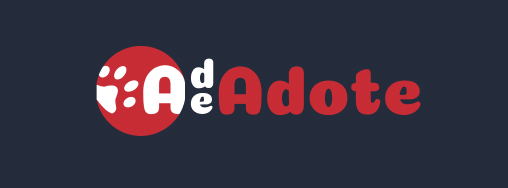
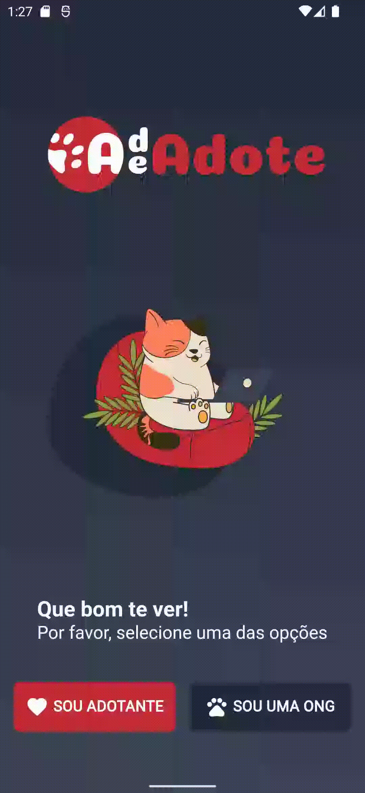
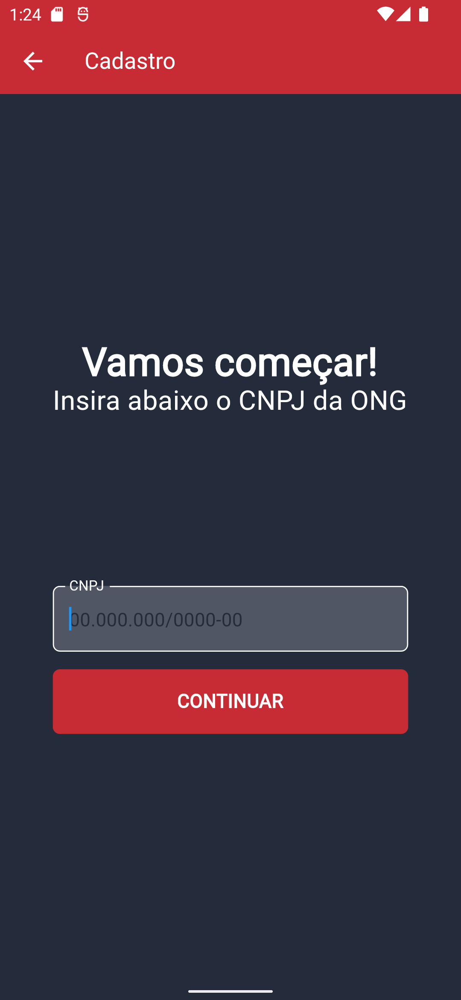
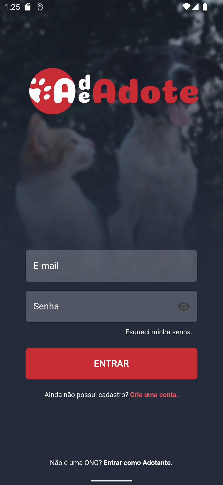

# A DE ADOTE - Ainda se encontra em fase de construção ✔️

  <a href="#-sobre">Sobre</a>&nbsp;&nbsp;&nbsp;|&nbsp;&nbsp;&nbsp;
  <a href="#-ideia">Ideia</a>&nbsp;&nbsp;&nbsp;|&nbsp;&nbsp;&nbsp;
  <a href="#-tecnologias">Tecnologias</a>&nbsp;&nbsp;&nbsp;|&nbsp;&nbsp;&nbsp;
  <a href="#-como_contribuir">Como contribuir</a>&nbsp;&nbsp;&nbsp;|&nbsp;&nbsp;&nbsp;
  <a href="#-telas_iniciais">Telas iniciais</a>&nbsp;&nbsp;&nbsp;|&nbsp;&nbsp;&nbsp;

  

## 💻 Sobre o projeto

:shipit: O projeto está sendo desenvolvido com o intuito de ajudar ONGS regionais a divulgar seus pets disponíveis para a adoção e conectá-los a possiveis interessados 🐶 🐱 🐰 

## 💡 Ideia do Projeto

Realizar conexão entre interesses comuns das pessoas e ONGs.

- Interessados em adotar um animal;
- Interessados em contribuir com ONGs.
- ONGs que queiram divulgar seus animais.

## 🚀 Tecnologias

Esse projeto está sendo desenvolvido com as seguintes tecnologias:
​
- Flutter-Dart
- Firebase Authentication
- Firebase Firestore
- Provider
- Figma
- Git e Github

## 🤔 Como contribuir

    Faça um fork desse repositório;
    Cria uma branch com a sua feature: git checkout -b minha-feature;
    Faça commit das suas alterações: git commit -m 'feat: Minha nova feature';
    Faça push para a sua branch: git push origin minha-feature.

Depois que o merge da sua pull request for feito, você pode deletar a sua branch.

## 🔖 Algumas Telas

  
  
  
  

